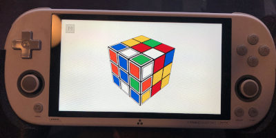
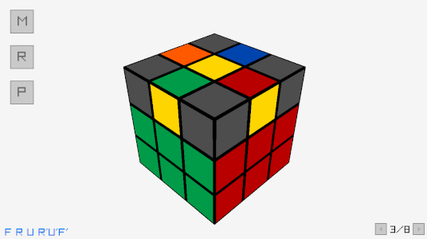

<h1 align="center">
   
  
   
  TSP Rubik's Cube
   
</h1>

This is a little game I wrote for my Trimui Smart Pro. It's optimized for 1280x720 resolution.

It uses [Golang bindings](https://github.com/gen2brain/raylib-go) for [RayLib](https://github.com/raysan5/raylib). My initial motivation was to learn some 3D programming.

It has 8 tutorials that show how to assemble some non-trivial states:

You can also play it on your desktop computer, although I haven't implemented any mouse gestures.

## Build

I use a Docker image with TSP SDK installed: https://github.com/geniot/trimui-smart-pro-toolchain

See the Makefile for more details.

For my desktop testing I use GoLand and Ubuntu.

## Deploy to TrimUI

1. On TrimUI find System Tools > Network > Display IP
2. Type `export IP=<IP>`
3. Optional: start Dummy app on TrimUI (https://github.com/geniot/tsp-dummy-banner)
4. Run `make all`